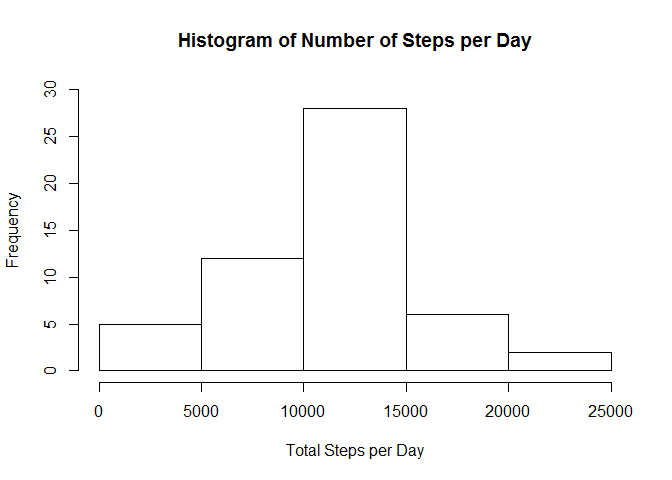
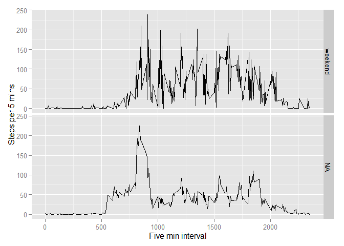

# Reproducible Research: Peer Assessment 1

## Loading and preprocessing the data
The data was accessed from a forked github project on <https://github.com/rdpeng/RepData_PeerAssessment1>.

```r
#Reading data in and 
unzip("activity.zip", exdir = "./data")
activity <- read.csv("data/activity.csv", stringsAsFactors = FALSE)
activity$date <- as.Date(activity$date)
activity$day <- weekdays(activity$date)

numstepsbyday <- tapply(activity$steps, activity$date, sum)
```

## What is mean total number of steps taken per day?
Here is a histogram of the distribution of steps per day. Note code includes commented out code for saving this and other plots to file.

```r
#png("stepsperdayhistogram.png", width = 480, height = 480)
hist(numstepsbyday, main = "Histogram of Number of Steps per Day",
        ylim = c(0, 30),
        xlab = "Total Steps per Day")
```

 

```r
#dev.off() ## must close device
```


```r
mean.daily.steps <-
        mean(numstepsbyday, na.rm = TRUE)
median.daily.steps <-
        median(numstepsbyday, na.rm = TRUE)
```
The mean number of steps per day is 10766 and the median is 10765 (figures rounded with no decimal points)

## What is the average daily activity pattern?
Here is a plot of the mean number of steps for each 5 minute interval.

```r
numstepsbyinterval <- tapply(activity$steps, activity$interval, mean,
        na.rm = TRUE)
max.steps.interval <- numstepsbyinterval[numstepsbyinterval == max(numstepsbyinterval)]
#png("stepsbyinterval.png", width = 480, height = 480)
plot(as.numeric(names(numstepsbyinterval)), numstepsbyinterval,
        type = 'l', xlab = "Five min interval",
        ylab = "Steps per 5 mins", main = "Mean number of steps per 5 mins",
        ylim = c(0,250), xlim = c(0,2400))
```

 

```r
#dev.off() ## must close device
```
The maximum mean number of steps per 5 minute interval is 206.1698113 recorded at interval 835

## Imputing missing values
Missing values were imputed by using the average for the 5 minute interval of that day of the week (thus combining two suggestions given in the instructions and preserving the weekday patterns).

A histogram shows the distribution of total number of steps per day.

```r
sum(is.na(activity$steps)) # no. of rows with missing value for steps
```

```
## [1] 2304
```

```r
library(plyr)
activity.day <- imputed.activity <- activity
activity.day$day <- weekdays(activity.day$date)
activity.day$interval <- as.factor(activity.day$interval)
step.interval.day <- ddply(activity.day, c("day", "interval"), summarise,
        mean = mean(steps, na.rm = TRUE))
for(i in 1:nrow(imputed.activity)){
        if(is.na(imputed.activity$steps[i])) { 
        imputed.activity$steps[i] <- step.interval.day$mean[
        step.interval.day$day == imputed.activity$day[i] &
        step.interval.day$interval == imputed.activity$interval[i]]
        }
}
write.csv(imputed.activity, file = "imputed.activity.csv",
        row.names = FALSE)
        
imputed.numstepsbyday <- tapply(imputed.activity$steps,
        imputed.activity$date, sum)

#png("stepsperdayhistogramimputed.png", width = 480, height = 480)
hist(imputed.numstepsbyday, main = "Histogram of Number of Steps per Day",
     ylim = c(0, 40),
     xlab = "Total Steps per Day")
```

 

```r
#dev.off() ## must close device

imputed.mean.daily.steps <- mean(imputed.numstepsbyday, na.rm = TRUE)
imputed.median.daily.steps <- median(imputed.numstepsbyday, na.rm = TRUE)
```
The mean number of steps per day for the data with imputed values is 10821 and the median is 11015 (figures are rounded with no decimal places).


## Are there differences in activity patterns between weekdays and weekends?
A facted plot was generated showing mean number of steps per 5 minute inerval according to whether the day was a weekday or a weekend day.

```r
imputed.activity$daytype[imputed.activity$day == c("Saturday", "Sunday")] <-
        "weekend"
imputed.activity$daytype[!imputed.activity$daytype == "weekend"] <-
        "weekday"
steps.by.interval.imputed <- ddply(imputed.activity, c("daytype",
        "interval"), summarise, mean = mean(steps, na.rm = TRUE))
library(ggplot2)
#png("weekendcomparison.png", width = 480, height = 480)
qplot(interval, mean, facets = daytype ~ ., geom = "line",
        ylab = "Steps per 5 mins", xlab = "Five min interval",
        data = steps.by.interval.imputed)
```

 

```r
#dev.off() ## must close device
```
